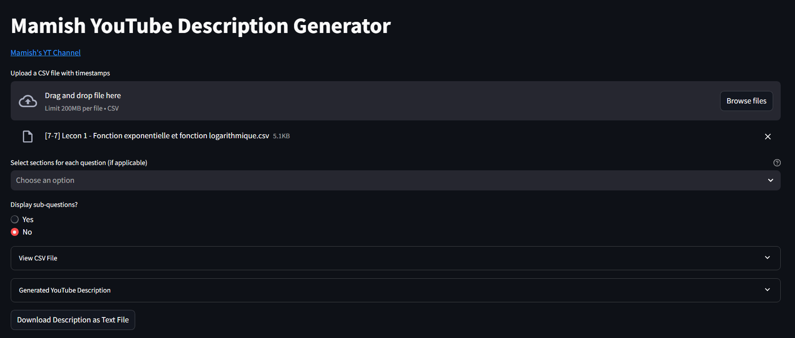
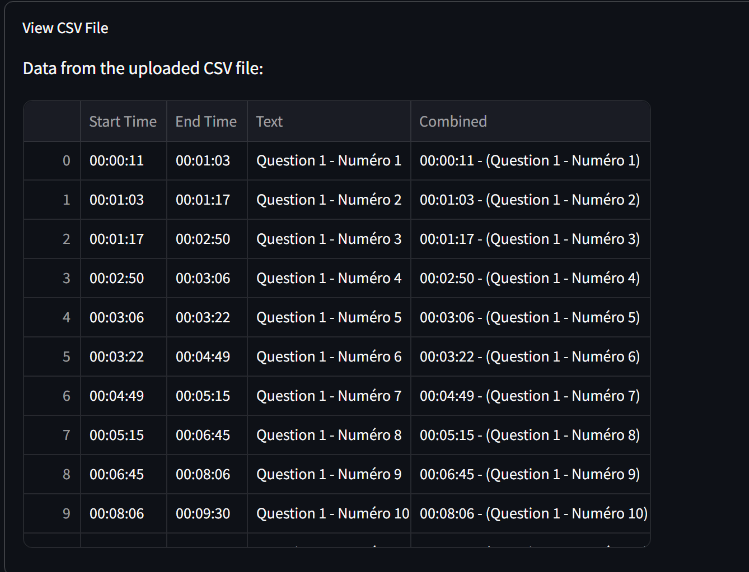
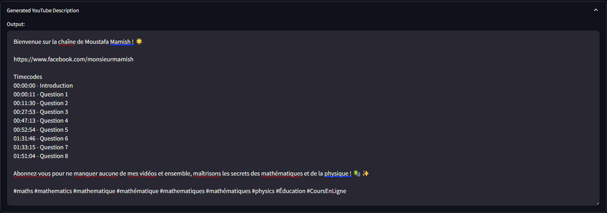

# 🎬 Mamish YouTube Description Generator 📜

---

Welcome to **Mamish YouTube Description Generator**! 🚀 This tool helps you automate the creation of YouTube video descriptions with sections based on timestamps and user input. It's perfect for streamlining your workflow and ensuring consistency in your video descriptions. 🎥



---

## 📦 Features

- 📄 **Upload Timestamps**: Easily upload a CSV file containing timestamps.
- 🔢 **Section Selection**: Choose between three customizable sections for each question.
- ❓ **Sub-questions Display**: Decide whether to show sub-questions or just the main ones.
- 📂 **Download**: Get your generated description in a `.txt` file for easy copy-paste into YouTube!

---

## 🛠 How It Works

1. **Upload a CSV File**: The CSV should include timestamps and questions from your video. You can upload it using the `Upload` button.
2. **Customize Sections**: Choose which sections your video should include, with options like:
   - *Premièrement* (First)
   - *Deuxièmement* (Second)
   - *Troisièmement* (Third)
3. **Sub-questions?**: You have the option to display or hide sub-questions.
4. **Generate & Download**: View the generated description and download it as a text file.

---

## 🚀 Getting Started

1. Clone the repository:
    ```bash
    git clone https://github.com/your-repo/mamish-description-generator.git
    cd mamish-description-generator
    ```

2. Install dependencies:
    ```bash
    pip install streamlit pandas
    ```

3. Run the app:
    ```bash
    streamlit run app.py
    ```
---

## 📊 CSV File Format

The CSV file should have the following columns:
- `Start Time`: The timestamp of the section in the format `hh:mm:ss`.
- `End Time`: The end timestamp (optional).
- `Text`: The content of the section.

💡 **Note**: The `Video Track` and `Layer ID` columns (if present) will be automatically ignored.

---

## 💡 Example

Here’s an example CSV file content:


Here's the output:
