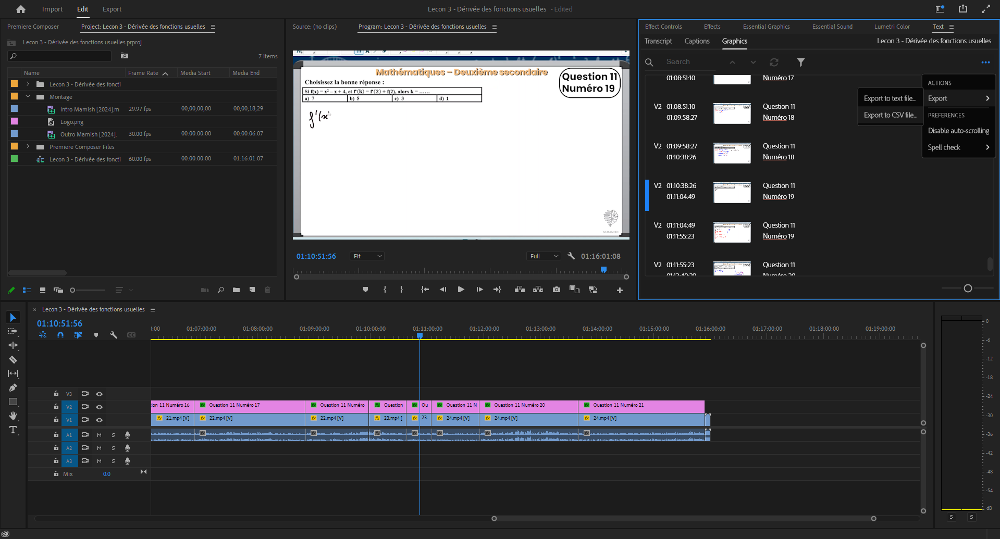
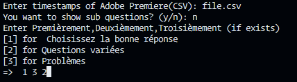

# Timestamps Automation



This project provides a Python script to automate the extraction of timestamps from Adobe Premiere and convert them into a format suitable for YouTube.

### How can I automate extracting timestamps from Adobe Premiere to the format the YT can understand?

### **Usage:**

1.  **Double Click on Text Layer**: In Adobe Premiere, double-click on the text layer containing your timestamps.
2.  **Export to CSV File**: Export the timestamps to a CSV file.
3.  **Run the Script on the CSV File**: Use the provided Python script to process the CSV file.
4.  **Boom! You Have It**: The script will generate a `output.txt` file with the formatted timestamps.

### Example Command

```python
main.py <CSV_FILE>
```

### Script Details

the script prompts you for the following inputs:



- **Enter timestamps of Adobe Premiere(CSV)**: The path to the CSV file exported from Adobe Premiere.
- **You want to show sub questions? (y/n)**: Whether to include sub-questions in the output.
- **Enter Premièrement, Deuxièmement, Troisièmement (if exists)**: Enter the section numbers for specific sections if applicable.

### Output

The script generates an `output.txt` file containing the formatted timestamps suitable for YouTube.
